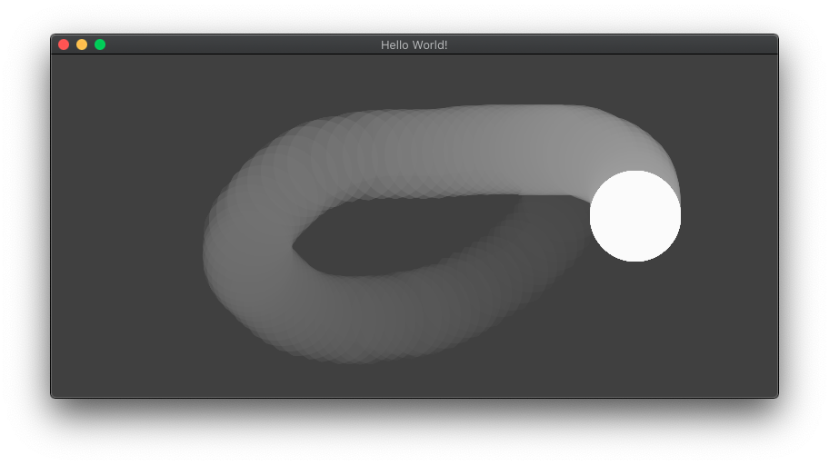

# electron-osc

Electron v12 からセキュリティが安全になった代わりに、rendered.jsで、requireなどが使えなくなりました。

そこで、preload.jsでrequireを使って、それをcontextBridgeという方法で、renderer.jsから間接的に使います。

ここにあるソースは、preload.jsで動作するnode-oscを、renderer.jsで使えるようにしたものです。まだ試作中で、効率が悪いかもしれません。


- renderer.jsにはp5jsのコードがあります。
- osc送信する
```javascript:rendere.js
    // OSCのAPI(preload.jsでcontextBridgeとして定義)
    const oscAPI = window.oscAPI;
    // OSCデータを送信する
    oscAPI.send('/test', [p.mouseX, p.mouseY]);
```

- osc受信する
```javascript:rendere.js
    // OSCデータを受信すると呼ばれる関数
    p.oscReceive = (msg) => {
        // OSCのAPI(preload.jsでcontextBridgeとして定義)
        const oscAPI = window.oscAPI;
        // OSCアドレスが一致する場合、dataが入る
        let data = oscAPI.receive("/test", msg);
        x = data[0];
        y = data[1];
        // console.log(data);
    }
```

</img>

実行すると、自分自身で、OSCサーバーとクライアントをつくります。
画面にマウスについてくる円が表示されますが、
これはOSCで送信したマウスの座標を、自分で受けとって円の座標にしています。

## OSCデータを送信する場合
### renderer.jsから、preload.jsへ送信する
contextBridge経由で、「oscAPI」の「send」を呼び出す。

以下、preload.jsの中です。

~~~javascript:preload.js
const { contextBridge, ipcRenderer } = require('electron')
contextBridge.exposeInMainWorld(
  "oscAPI", {
  send: (_address, _data) => {
    const message = new Message(_address);
    for (let i = 0; i < _data.length; i++) {
      message.append(_data[i]);
    }
    client.send(message);
  },

~~省略~~

})
~~~

## OSCデータを受信する場合
### preload.jsから、renderer.jsへ送信する
こちらはcontextBridgeではなく、node-oscのOSC受信時で呼ばれる関数で、renderer.jsへ値を渡しています。
preload.js、renderer.js、index.htmlの3つのファイルが関係しています。

以下、preload.jsの中です。

~~~javascript:preload.js
// OSC受信時に呼ばれる関数
oscServer.on('message', function (msg) {

  // 「container」に、カスタムイベントを発火する
  // カスタムイベントには、oscで受信したメッセージを追加しておく
  const targetElement = document.getElementById('container')
  targetElement.dispatchEvent(new CustomEvent("osc_rcv", {
    detail: { oscMsg: msg }
  }));

});

const { contextBridge, ipcRenderer } = require('electron')
contextBridge.exposeInMainWorld(
  "oscAPI", {

  ~~省略~~

  receive: (_address, _msg) => {
    let res = [];
    if (_msg[0] === _address) {
      for (let i = 0; i < (_msg.length - 1); i++) {
        res[i] = _msg[i + 1];
      }
    }
    return res;
  }
})
~~~

以下、renderer.jsの中です。

~~~javascript:renderer.js

const s = (p) => {

    ~~省略~~

    // OSCデータを受信すると呼ばれる関数
    p.oscReceive = (msg) => {
        // OSCのAPI(preload.jsでcontextBridgeとして定義)
        const oscAPI = window.oscAPI;
        // OSCアドレスが一致する場合、dataが入る
        let data = oscAPI.receive("/test", msg);
        x = data[0];
        y = data[1];
        // console.log(data);
    }
}

// ID名'container'のエレメントを取得して、
// p5jsインスタンスを'container'にいれる
const container = document.getElementById('container');
const app = new p5(s, container);

// OSC受信イベントがあったとき、
// p5js内の「oscReceive」関数に、oscMsgを引数として渡す
container.addEventListener("osc_rcv", (event) => {
    app.oscReceive(event.detail.oscMsg);
});

~~~


index.htmlで、bodyのdivタグにID名「container」とつけてあります。

以下、index.htmlの中です。

~~~html:index.html
<body>
  <div id='container'></div>

  ~~省略~~

</body>
~~~

